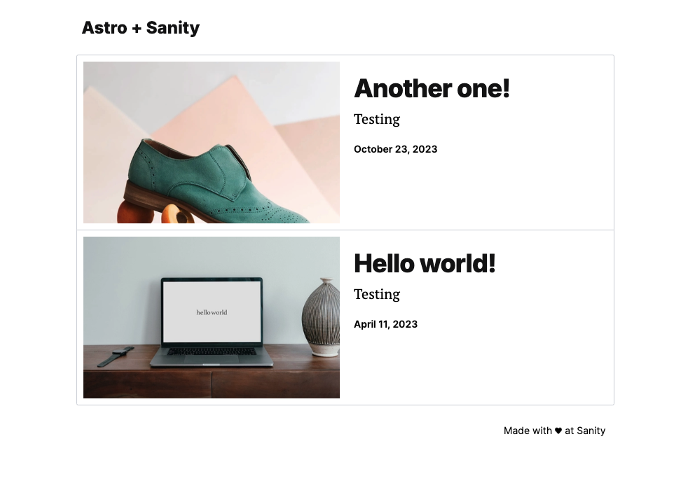

# Minimal Astro site with Sanity Studio

This starter uses [Astro](https://astro.build/) for the front end and [Sanity](https://sanity.io/) to handle its content.



## Features

- Fetch content as data from [the Sanity Content Lake](https://www.sanity.io/docs/datastore)
- Render block content with [Portable Text](https://www.sanity.io/docs/presenting-block-text)
- Manage and create content with the intuitive [Sanity Studio](https://www.sanity.io/docs/sanity-studio).
- Crop and render images with [Sanity Image URLs](https://www.sanity.io/docs/presenting-images)

## Demo

[Try the live demo](https://template-astro-clean.sanity.build/)

## Getting Started

### Prerequisites

- [Node.js](https://nodejs.org/en/) - Astro requires v18.17.1 or v20.3.0, v22.0.0 or higher. ( v19 and v21 are not supported.)

### Setup Steps

#### 1. Install the template

Run the command in your Terminal to initialize this template on your local computer.

See the documentation if you are [having issues with the CLI](https://www.sanity.io/help/cli-errors).

```shell
npm create sanity@latest -- --template sanity-io/sanity-template-astro-clean
```

#### 2. Run your app locally

After running the command, your Astro app should now be running on [http://localhost:4321/](http://localhost:4321/) and Sanity Studio on [http://localhost:4321/admin](http://localhost:4321/admin).

```shell
npm run dev`
```

#### 3. Add content

1. Visit the Studio and create and publish a new `Post` document
2. Visit the homepage and refresh the page to see your content rendered on the page

The schema for the `Post` document is defined in the `/schema` folder. You can [add more document types](https://www.sanity.io/docs/schema-types) to the Studio to suit your needs.

### Deployments

Feel free to deploy the App to whichever hosting provider you prefer ([Vercel](https://vercel.com/), [Netlify](https://netlify.com), [Cloudflare](https://pages.cloudflare.com/), etc). Remember [to change the adapter](https://docs.astro.build/en/guides/server-side-rendering/#adding-an-adapter) in the `astro.config.mjs` file to match your hosting provider.

## Resources

- [Sanity.io Documentation](https://www.sanity.io/docs/)
- [Astro Documentation](https://docs.astro.build/en/getting-started/)
- [Portable Text Guide](https://www.sanity.io/docs/presenting-block-text)

### Removing TypeScript

If you do not wish to use TypeScript, we've included a `remove-typescript.mjs` file in the root of this repository. You can run this file with `node remove-typescript.mjs` to strip all types from this project. Please run this before tampering with any code to ensure that all types are properly removed.

If you intend to use TypeScript, you can safely remove the `remove-typescript.mjs` file.

### Removing the embedded Studio

If you wish to manage and host the Studio separately, you remove the `studioBasePath` property for the `sanity` configuration in `astro.config.mjs`. You can also remove the following dependencies:

- `output` in `astro.config.mjs`…
  - …and `adapter` in `astro.config.mjs`
- `react()` in `astro.config.mjs`
- `@sanity/vision` `react` `react-dom` `@types/react` `@types/react-dom` from `package.json`
- `schema` folder (you might want to copy this to the new Studio location)
- `sanity.config.ts` (you might want to copy this to the new Studio location)
